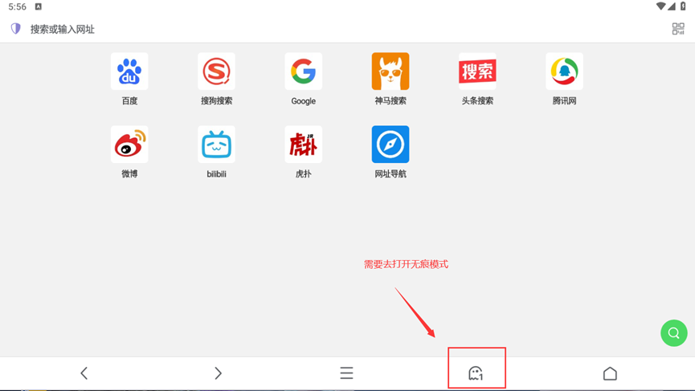
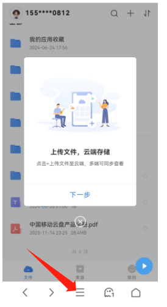
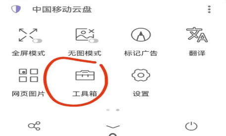
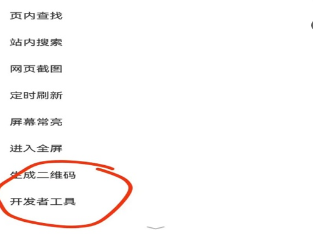
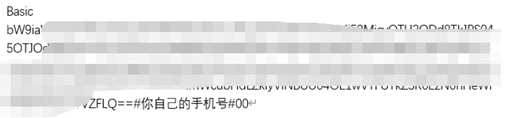

# 移动云盘自动化任务程序操作手册

## 项目介绍

## 1.获取token变量

安卓手机：点击链接下载alook浏览器。

苹果手机：app store去下载Alook浏览器 需要8r，自行考虑。

windows端：下载edge，安装插件milk-cookie manager

### 操作步骤

#### 安卓/苹果端

1）打开无痕模式(为什么要打开无痕模式：打开无痕模式关alook浏览器可以直接登陆另一个账号不会导致上一个抓取的账号ck过期）  

2）输入链接https://yun.139.com/m/#/main?linkshare=1 登录移动云盘账号

3）点击中心选项

4)找到工具箱

5)选择开发者工具

6）开发者工具中选择cookies，然后复制cookies

在cookies中找到：authorization，并复制其中内容

#### Windows端
1）打开edge浏览器找到拓展标志，点击获取Microsoft Edge拓展

2）搜索milk cookie manager，下载安装如下插件

3）输入链接https://yun.139.com/m/#/main?linkshare=1 登录移动云盘账号

4)登陆账号后，点击milk拓展，获取authorization值

5）如何切换账号，使用milk插件删除所有ck后刷新网站重新登陆即可。

## 2.token格式

Token格式为：

authorization值#所登录移动云盘账号的手机号#00
